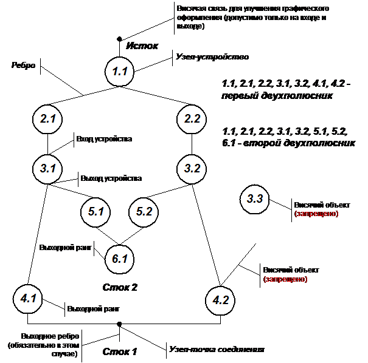
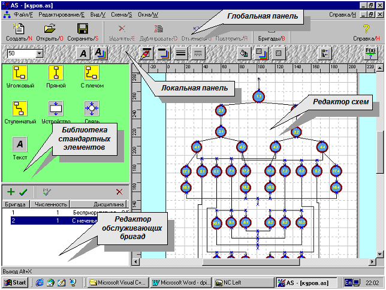

## Reliability Analyst

Представляет из себя десктопное Win32 приложение на C++ / Visual Studio 6 / MFC для анализа надёжностных схем при помощи схематического моделирования двухполюсниками. Имеет Visio-подобный редактор для построения схем и пошаговый режим их упрощения с целью рассчёта показателей надёжности.

**Надёжностная модель системы** 

**UI** 

>[Полная документация](./DOC/dpiplom.doc) 
[Исполняемые файлы Win32](https://github.com/alexf2/ReliabilityAnalyst/releases/download/Release1/Release1.zip)